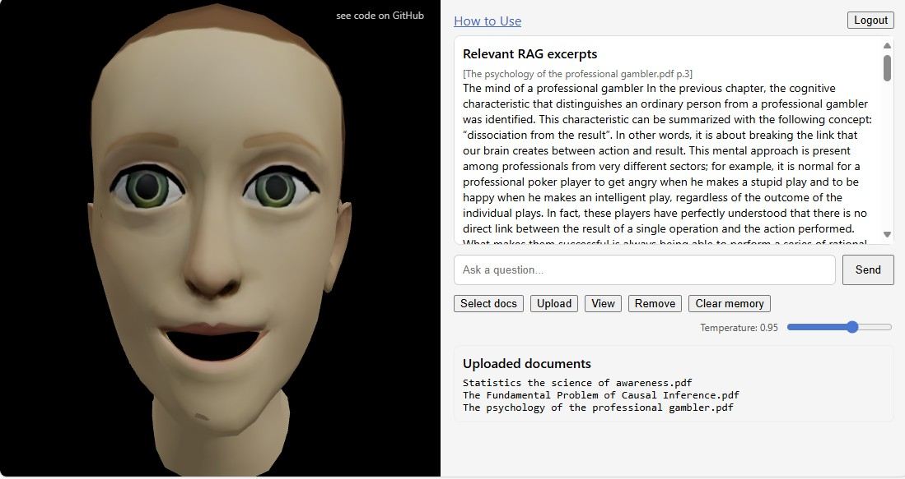

# 3D RAG Avatar

A full-stack conversational AI application featuring document-powered retrieval (RAG), secure user authentication, and a real-time animated 3D avatar (ARKit → GLB morph mappings). Built with React, Three.js, FastAPI, Pinecone, and Sea-Lion LLM, all containerized via Docker.

---
  
*Avatar in Action*

  
*Secure user registration & login*

---

## Table of Contents

1. [Features](#features)  
2. [Architecture](#architecture)  
3. [Getting Started](#getting-started)  
   - [Prerequisites](#prerequisites)  
   - [Environment Variables](#environment-variables)  
   - [Docker Setup](#docker-setup)  
   - [Local Development](#local-development)  
4. [Folder Structure](#folder-structure)  
5. [Usage](#usage)  
6. [Screenshots](#screenshots)  
7. [License](#license)  

---

## Features

- **User Authentication**  
  - Email/password registration & login  
  - JSON-stored user data with bcrypt-hashed passwords  

- **Document Ingestion & RAG**  
  - Upload multiple PDFs via `/api/upload`  
  - Automatic text extraction, chunking & Pinecone indexing  
  - Context-aware chat: searches both documents and conversation history  

- **Conversational AI**  
  - FastAPI backend serving `/api/chat` endpoints  
  - Integration with Sea-Lion LLM for chat completions  
  - JWT-based auth, 12-hour token expiry  

- **3D Animated Avatar**  
  - React + three.js (`@react-three/fiber`)  
  - Morph-target blending for expressions, visemes, gestures  
  - Real-time speech-synthesis viseme mapping & nod/shake animations  

- **Debug & Testing Tools**  
  - Morph Map Tester: verify ARKit → GLB morph mapping  
  - Debug HUD & Debug Morph Panel for rapid iteration  

- **Containerized Deployment**  
  - Multi-stage Dockerfile: builds React frontend then Python backend  
  - Exposes port `10000` for HTTP & static file serving  

---

## Architecture


---

## Getting Started

### Prerequisites

- [Docker Engine](https://www.docker.com/) ≥ 20.x  
- [Docker Compose](https://docs.docker.com/compose/) (optional)  
- Local `.env` file at project root  

### Environment Variables

Create a `.env` file with the following keys:

```bash
# Sea-Lion LLM
SEA_LION_API_KEY=your_sealion_api_key

# JWT Auth
JWT_SECRET=super_secret_key

# Pinecone
PINECONE_API_KEY=your_pinecone_api_key
PINECONE_CLOUD=aws
PINECONE_REGION=us-east-1
PINECONE_INDEX_DOCS=user-docs-index
PINECONE_INDEX_CHAT=user-chat-index

# Users storage (optional override)
USERS_FILE=users.json
Docker Setup

# Build & run
```bash
docker build -t ai-chat-app .
docker run -d \
  --name ai-chat \
  --env-file .env \
  -p 10000:10000 \
  ai-chat-app
```

# Access
```bash
Web UI: http://localhost:10000

API health: GET http://localhost:10000/health
```

# Local Development
## Backend
```bash
cd backend
pip install -r requirements.txt
uvicorn backend.app.main:app --reload --host 0.0.0.0 --port 10000
```

## Frontend
```bash
cd frontend
npm install
npm run dev
```

## Proxy
```bash
Frontend proxies /api to http://localhost:10000 via Vite config.
```

# Folder Structure


# Usage

### Register a new account.

Login to obtain a unique working space with persistent memory accors sessions.

Upload one or more PDFs to ingest content.

Chat with the assistant—queries leverage your documents plus chat history.

Observe the animated avatar providing the answers, with expressions, visemes, and head gestures.

  
*ARKit → GLB morph mapping*

  
*Searches both Documents and Conversation history*

License
MIT License

---
